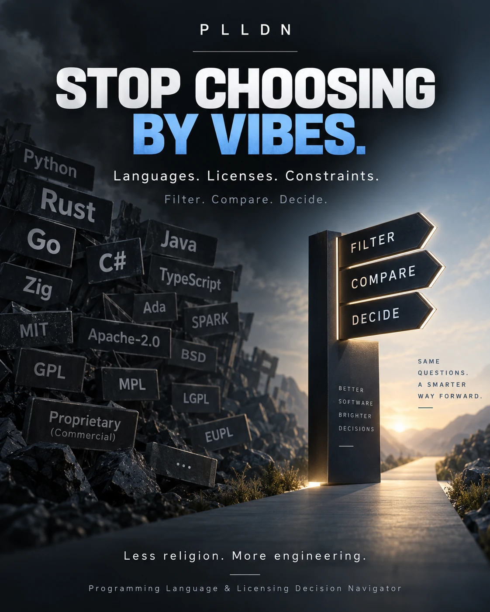

# PLLDN - Programming Language & Licensing Decision Navigator

**Choose technologies from project constraints — not hype.**

PLLDN helps turn concrete project requirements into a small, explainable set of programming-language options. It shows why candidates fit, where Reviewed evidence is missing, and when the responsible answer is simply **not enough information yet**.

**Outcome:** less tab-hopping, fewer SEO/influencer comparison loops, and a more defensible starting point for architecture decisions without pretending there is one universal “best language.”

**For:** developers and maintainers who want constraint-first comparisons, traceable reasoning, and explicit abstention when the evidence cannot support a recommendation.

**Status:** **v0.0.1 Beta 1** prerelease · community-supported · no response-time guarantee.

**Use it now:** [Open the verified GitHub Pages app →](https://keilerhirsch.github.io/PLLDN-Programming-Language-Licensing-Decision-Navigator/)



**Setup:** no account, API key, LLM, or provider setup is required for the live Beta. Use the filters directly, or optionally describe constraints in plain text; free text only proposes existing filters and you confirm them before they affect the decision.

## 30-second workflow

1. **Describe the project constraints** with the existing filters or the optional plain-text helper.
2. **Review what PLLDN understood.** Text assistance proposes canonical filters; nothing is silently applied.
3. **Confirm only what is correct.** Manual filters and confirmed text use the same authoritative decision path.
4. **Compare the surviving candidates.** Unknown evidence stays unknown instead of being guessed into a score.
5. **Open the reasoning when you need it.** Decision traces and Reviewed evidence explain why candidates fit, fail, or remain unresolved.

**Before using:** the live Beta currently covers Go, Python, Rust, and TypeScript across four Reviewed boolean capability dimensions. Eight SPDX license identities are Reviewed, but they are not yet exposed as a complete live licensing recommendation workflow. PLLDN does not provide legal advice or certification.

**Verify:** [Release](https://github.com/KeilerHirsch/PLLDN-Programming-Language-Licensing-Decision-Navigator/releases/tag/v0.0.1-beta.1) · [Verification](docs/verification.md) · [Changelog](CHANGELOG.md)

**Next:** [Architecture](docs/architecture.md) · [Data contracts](docs/data-contracts.md) · [Contributing](CONTRIBUTING.md) · [Security](SECURITY.md) · [License](LICENSE) · [Support](#support)

> [!IMPORTANT]
> ### Support PLLDN
> PLLDN is free and community-supported. If it saves you time, you can support maintenance through [Ko-fi](https://ko-fi.com/keilerhirsch).
>
> [GitHub Sponsors](https://github.com/sponsors/KeilerHirsch) remains linked for future availability, but it is not currently an active native funding destination. On GitHub, the native **Sponsor** button and **Sponsor this project** panel currently expose the verified Ko-fi route.
>
> Voluntary support creates no feature entitlement, ranking influence, approval authority, review priority, or release priority.

## What PLLDN does

PLLDN is built around a simple product rule: **the project constraints come first; the technology list comes second.**

- **Constraint-first:** requirements determine eligibility before any ranking or presentation preference.
- **Explainable:** material outcomes have a decision trace instead of an unexplained “AI says so” answer.
- **Honest about unknowns:** missing evidence is not silently converted into false, true, or a decorative confidence percentage.
- **Low-friction text assistance:** plain text is a shortcut for proposing existing filters, not a second recommendation engine.
- **One decision path:** manual filters and confirmed text proposals converge on the same canonical project facts and deterministic evaluator.
- **Component-aware:** language and license choices are scenario-specific; PLLDN does not crown a universal winner for every project.
- **Progressive depth:** the default path stays compact while evidence, provenance, architecture and assurance remain available for users who want to inspect the machinery.

The long-term product combines programming-language and licensing decisions in one navigator. **Beta 1 deliberately exposes only a narrow live language slice today.** The Reviewed license identities and deeper licensing control-plane work are foundations for later product stages, not a claim that the current browser UI already replaces legal analysis.

## Scope and trust model

Under the simple UI, PLLDN remains deliberately strict.

The Beta 1 package contains the deterministic decision/facet core, Reviewed knowledge, framework-free browser UI, explicit-confirmation free-text assistance, the verified GitHub Pages runtime, and read-only community maintenance controls. Filters and explicit project facts remain authoritative; free text can only propose existing facets and cannot confirm them automatically.

Runtime trust is separate from the product workflow. The core and ordinary browser build ship no default snapshot approval pin. The Pages deployment profile separately approves the Reviewed source manifest and a minimal 16-document runtime projection. That projection contains only the four live language entities, four boolean capability dimensions, four supporting claims, and four primary sources; it contains no current-version claims or licensing records.

Beta 1 makes no claim of complete license compatibility analysis, universal natural-language understanding, general recommendation accuracy, or certification. Correct abstention is expected when Reviewed evidence is insufficient.

## Run locally and verify

Install Node.js **24.15.0** with npm **11.12.1**, then:

```sh
npm ci --ignore-scripts
npm run verify
npm run evidence
```

To build the current static browser shell locally:

```sh
npm run build:browser
```

Generated ordinary-browser files go to ignored `.build/site/`. The repository does not embed or ship a default trusted runtime snapshot, so that standalone shell intentionally shows an unavailable state until approved runtime material is injected. To build the deployment-only Pages artifact locally, run `npm run build:pages`; it writes ignored `.build/pages/` with the separately approved runtime projection.

Verification checks types, repository policy, formatting and tests with coverage. Reports are written to the ignored `reports/` directory. Network access is needed for dependency installation and vulnerability checks; contract and snapshot checks do not fetch knowledge or remote schemas.

## Decision principles

- Filters and explicit project facts are authoritative.
- Constraints come before ranking. Unknown is never silently false.
- Knowledge needs scope, sources, review and reproducible evidence.
- A candidate cannot approve itself. Released snapshots remain immutable.
- Human review and runtime snapshot approval are separate trust decisions.
- UI counts and material candidate states reuse the deterministic decision core.
- Free text may propose filters; only confirmed proposals enter the existing facet path.
- Correct abstention is preferred over guessed text interpretation.
- Language and license choices are component- and scenario-specific.

The first public product release identity is **v0.0.1 Beta 1**. Exact coverage and known limitations ship as release assets; published corrections use a superseding Beta rather than mutating an immutable release.

For the deeper engineering story, start with [architecture](docs/architecture.md), [data contracts](docs/data-contracts.md), [verification](docs/verification.md), or [contributing](CONTRIBUTING.md).

## Support

PLLDN will be free to use, without a paid feature tier. If the project is useful to you, voluntary support is welcome through [Ko-fi](https://ko-fi.com/keilerhirsch) or [GitHub Sponsors](https://github.com/sponsors/KeilerHirsch). On GitHub, the native Sponsor button exposes Ko-fi as the currently verified active support route. GitHub controls Sponsors availability for the linked account.

Voluntary funding creates no feature entitlement, ranking influence, approval authority, or review privilege.

Own code, documentation and project data are licensed under [EUPL-1.2](LICENSE).
